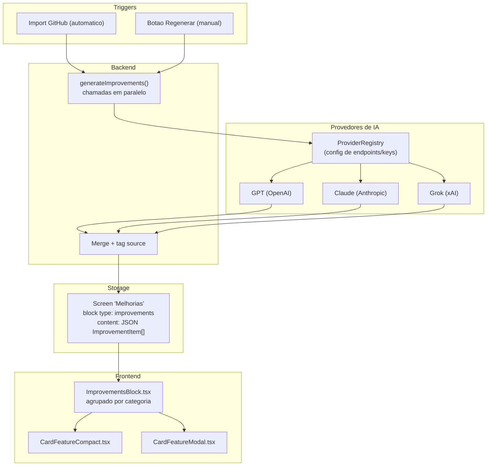

# Aba "Melhorias" nos Cards

## Conceito

Nova aba especial (como "Flow" e "Visao Geral") que mostra sugestoes de **multiplas IAs** sobre o codigo do card. Cada sugestao tem severidade, categoria, arquivo afetado e **qual IA a gerou**. Visualizacao agrupada por categoria (seguranca, performance, etc.), com badges indicando a IA de origem. Gerada automaticamente no import do GitHub e regeneravel manualmente.

## Arquitetura




## 1. Tipos (backend + frontend)

Adicionar em `[backend/src/types/cardfeature.ts](backend/src/types/cardfeature.ts)`:

```typescript
export type ImprovementSeverity = 'high' | 'medium' | 'low'
export type ImprovementCategory =
  | 'performance'
  | 'security'
  | 'quality'
  | 'architecture'
  | 'best-practices'
  | 'maintainability'

export interface ImprovementItem {
  title: string
  description: string
  category: ImprovementCategory
  severity: ImprovementSeverity
  source: string       // nome do provedor: "GPT-4", "Claude", "Grok", etc.
  file?: string
  line?: string
  suggestion?: string  // trecho de codigo sugerido
}

export interface ImprovementProvider {
  name: string         // nome exibido no badge: "GPT-4", "Claude", "Grok"
  model: string        // modelo especifico: "gpt-4o", "claude-sonnet-4-20250514", "grok-3"
  endpoint: string     // URL da API de completions
  apiKeyEnv: string    // nome da env var com a key: "OPENAI_API_KEY", "ANTHROPIC_API_KEY", etc.
  enabled: boolean     // permite desativar sem remover config
}
```

Adicionar ao enum `ContentType`:

```typescript
IMPROVEMENTS = 'improvements'
```

Espelhar os mesmos tipos em `[frontend/types/index.ts](frontend/types/index.ts)`.

## 2. Backend -- Registro de provedores

Novo arquivo `[backend/src/services/improvementProviders.ts](backend/src/services/improvementProviders.ts)`:

- Exporta array de `ImprovementProvider` configurados via env vars
- Cada provedor tem: name, model, endpoint, apiKeyEnv, enabled
- Provedores so sao ativados se a env var da key existir (graceful degradation)
- Configuracao inicial (exemplo):

```typescript
const providers: ImprovementProvider[] = [
  {
    name: 'Grok',
    model: process.env.OPENAI_MODEL || 'grok-3',
    endpoint: resolveChatCompletionsUrl(),
    apiKeyEnv: 'OPENAI_API_KEY',
    enabled: true
  },
  {
    name: 'GPT-4',
    model: 'gpt-4o',
    endpoint: 'https://api.openai.com/v1/chat/completions',
    apiKeyEnv: 'OPENAI_GPT_API_KEY',
    enabled: true
  },
  {
    name: 'Claude',
    model: 'claude-sonnet-4-20250514',
    endpoint: 'https://api.anthropic.com/v1/messages',
    apiKeyEnv: 'ANTHROPIC_API_KEY',
    enabled: true
  }
]
```

- Funcao `getActiveProviders()` retorna apenas os que tem key configurada e estao `enabled`
- Se nenhum provedor estiver ativo, a geracao de melhorias e silenciosamente ignorada

## 3. Backend -- Geracao de melhorias (multi-IA)

Em `[backend/src/services/aiCardGroupingService.ts](backend/src/services/aiCardGroupingService.ts)`, criar:

- `**generateImprovementsFromProvider(params, provider)**` -- chama um unico provedor, retorna `ImprovementItem[]` ja com `source` preenchido
- `**generateImprovements(params)**` -- orquestra chamadas em **paralelo** (`Promise.allSettled`) a todos os provedores ativos, mergeia resultados, trata falhas individuais
- `**addMelhoriasScreen(card)`** -- chamada apos `addVisaoGeralScreen`, gera melhorias e adiciona screen ao card

**Fluxo de chamada:**

```
generateImprovements(params)
  -> getActiveProviders()
  -> Promise.allSettled([
       generateImprovementsFromProvider(params, grok),
       generateImprovementsFromProvider(params, gpt4),
       generateImprovementsFromProvider(params, claude),
     ])
  -> merge fulfilled results (ignorar rejected)
  -> retorna ImprovementItem[] unificado
```

**Prompt da IA** (mesmo prompt pra todos os provedores):

- Analisar todo o codigo do card
- Retornar JSON array de `ImprovementItem` (sem campo `source`, preenchido pelo orquestrador)
- Priorizar: seguranca > performance > qualidade > arquitetura (sem limite de quantidade)
- Ser especifico (referenciar arquivo e linha)
- Nao sugerir mudancas cosmeticas ou de estilo
- Responder em portugues

**Adaptador por provedor**: Para Claude, adaptar o formato de request/response (Messages API vs Chat Completions). O `callChatCompletions` atual funciona para OpenAI-compatible (Grok, GPT). Para Claude, criar wrapper `callAnthropicMessages`.

**Endpoint para regeneracao manual**: Novo endpoint em `[backend/src/routes/cardFeatureRoutes.ts](backend/src/routes/cardFeatureRoutes.ts)`:

- `POST /api/card-features/:id/improvements` -- gera/regenera melhorias para um card existente
- Aceita query param opcional `?provider=grok,claude` para regenerar apenas de provedores especificos

Controller em `[backend/src/controllers/CardFeatureController.ts](backend/src/controllers/CardFeatureController.ts)`:

- `generateImprovements` -- busca o card, chama orquestrador, atualiza a screen "Melhorias" (cria ou substitui)

## 4. Frontend -- Componente de renderizacao

Novo arquivo `frontend/components/ImprovementsBlock.tsx`:

- Recebe `ImprovementItem[]` parseado do JSON
- **Agrupamento primario por categoria** (secoes: Seguranca, Performance, Qualidade, etc.)
- Dentro de cada categoria, cada item mostra:
  - **Badge da IA de origem** (cor unica por provedor: ex. verde pra Grok, azul pra GPT, roxo pra Claude)
  - Badge de severidade (vermelho/amarelo/verde para high/medium/low)
  - Titulo em destaque
  - Descricao expandivel (collapse/expand)
  - Arquivo afetado como link
  - Sugestao de codigo em bloco `code` (se houver)
- Cabecalho com contadores: "X melhorias (N provedores) -- Y seguranca, Z performance, ..."
- Categorias ordenadas por relevancia: seguranca > performance > qualidade > arquitetura > best-practices > maintainability
- Dentro de cada categoria, ordenar por severidade (high primeiro)
- Se multiplas IAs apontarem o mesmo problema, elas aparecem como itens separados (cada IA com sua perspectiva e badge)

## 5. Frontend -- Integracao nos componentes

### `[frontend/components/ContentRenderer.tsx](frontend/components/ContentRenderer.tsx)`

- Adicionar case para `ContentType.IMPROVEMENTS` que renderiza `ImprovementsBlock`

### `[frontend/components/CardFeatureCompact.tsx](frontend/components/CardFeatureCompact.tsx)`

- Adicionar `isMelhoriasScreen()` (deteccao por nome, igual Flow)
- Tab aparece normalmente entre as demais
- Botao de regenerar (icone Sparkles ou RefreshCw) quando a aba esta ativa, com tooltip "Regenerar melhorias"
- Na aba "Visao Geral", se nao existir aba Melhorias, mostrar botao "Analisar codigo" (similar ao "Gerar Flow")

### `[frontend/components/CardFeatureModal.tsx](frontend/components/CardFeatureModal.tsx)`

- Mesma logica: `isMelhoriasScreen`, coluna fixa (nao arrastavel, igual Flow e Visao Geral)
- Ordem das colunas fixas: Flow > Visao Geral > Melhorias > ... colunas de codigo
- Botao de regenerar no canto superior direito da coluna

## 6. Pipeline de import do GitHub

Em `[backend/src/services/aiCardGroupingService.ts](backend/src/services/aiCardGroupingService.ts)`:

- Na funcao `addVisaoGeralScreen`, apos gerar a Visao Geral, chamar `addMelhoriasScreen` para cada card
- A geracao de melhorias chama **todos os provedores ativos em paralelo** (nao a mesma chamada do resumo)
- `temperature: 0.2` para consistencia em todos os provedores
- Se um provedor falhar, os demais continuam normalmente (resiliencia via `Promise.allSettled`)

Em `[backend/src/services/githubService.ts](backend/src/services/githubService.ts)`:

- Nos callbacks `onCardReady` de `connectRepo` e `importBranch`, garantir que o fluxo passa por `addMelhoriasScreen`

## 7. Custos e limites

- **Tokens**: sem `max_tokens` definido inicialmente -- vamos observar o consumo real de cada provedor antes de limitar
- **Custo**: N provedores = N chamadas de IA por card. Com 3 provedores ativos, sao 3x o custo. Provedores podem ser desativados via env var.
- **Rate limiting**: mesma logica do Flow -- um card so pode ter melhorias regeneradas se ja tiver sido gerado ha mais de X minutos (evitar abuso)
- **Fallback**: se todos os provedores falharem, o card e criado normalmente sem a aba Melhorias (nao deve bloquear o import)

## Decisoes de design

- A aba "Melhorias" e **opcional** -- cards sem melhorias simplesmente nao mostram a aba
- Regenerar **substitui** as melhorias anteriores de todos os provedores (nao acumula)
- O prompt deve receber o contexto do titulo, descricao e tech do card para gerar sugestoes relevantes
- Sugestoes devem focar em problemas **praticos** que o dev pode corrigir, nao em opiniao de estilo
- Quando duas IAs apontam o mesmo problema, ambas aparecem -- isso **reforça** a importancia da sugestao (usuario ve que 2 de 3 IAs concordam)
- Provedores que nao tiverem key configurada sao ignorados silenciosamente (permite comecar com 1 e ir adicionando)

