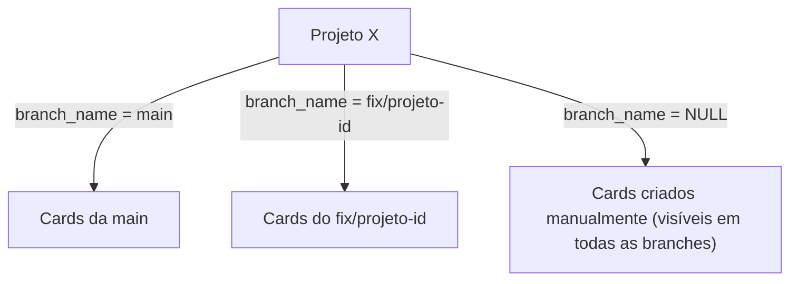

# Multi-Branch Card Isolation

## Arquitetura

**Hoje:** `project_cards(project_id, card_feature_id)` — sem branch. Todos os cards se misturam.

**Depois:** `project_cards(project_id, card_feature_id, branch_name)` — cards isolados por branch.




`github_file_mappings` já tem `branch_name` — o import já é branch-aware na camada de arquivo. A lacuna é só no `project_cards`.

## Fases

### Fase 1 — Fundação (este plano)

Branch-aware cards: import, listagem e seletor de branch na UI.

### Fase 2 — Futuro (documentado, não implementado agora)

- Commit diff tracking por branch (ver qual commit afetou qual card)
- Sugestões de IA contextuais à branch ativa
- Push bidirecional para a branch selecionada

---

## Arquivos-chave

- `[backend/src/services/githubService.ts](backend/src/services/githubService.ts)` — adicionar `listBranches()` e `importBranch()` (nova função focada, não reutiliza `connectRepo`)
- `[backend/src/models/ProjectModel.ts](backend/src/models/ProjectModel.ts)` — queries de cards precisam filtrar por `branch_name`
- `[backend/src/controllers/ProjectController.ts](backend/src/controllers/ProjectController.ts)` — novos endpoints de branches e import-branch
- `[backend/src/routes/projectRoutes.ts](backend/src/routes/projectRoutes.ts)` — registrar rotas novas
- `[frontend/pages/ProjectDetail.tsx](frontend/pages/ProjectDetail.tsx)` — seletor de branch + trigger de import
- `[frontend/services/projectService.ts](frontend/services/projectService.ts)` — novos métodos de API

---

## Tasks

### Task 1 — DB: `branch_name` em `project_cards`

- Migration via MCP Supabase:

```sql
ALTER TABLE project_cards ADD COLUMN branch_name TEXT DEFAULT NULL;

-- Usa o default_branch real de cada projeto (não hardcoda 'main')
UPDATE project_cards pc
SET branch_name = p.default_branch
FROM projects p
WHERE p.id = pc.project_id
  AND pc.branch_name IS NULL
  AND p.default_branch IS NOT NULL;

CREATE INDEX ON project_cards(project_id, branch_name);
```

- Cards existentes recebem o `default_branch` do projeto (retroativo)
- Cards de projetos sem `default_branch` ficam com `NULL` (visíveis em qualquer branch)
- Cards criados manualmente no futuro ficam com `NULL` (visíveis em qualquer branch selecionada)

### Task 2 — Backend: `listBranches` no GithubService

- Novo método `static async listBranches(token, owner, repo): Promise<string[]>`
- Chama `GET https://api.github.com/repos/{owner}/{repo}/branches`
- Retorna array de nomes de branch

### Task 3 — Backend: endpoint `GET /projects/:id/github/branches`

- Novo handler em `ProjectController`
- Busca `github_owner`, `github_repo`, `github_installation_id` do projeto
- Obtém token via `GithubService.getInstallationToken`
- Chama `GithubService.listBranches` e retorna lista

### Task 4 — Backend: query de cards com filtro de branch

- `ProjectModel.getCards` e `getCardsAll` recebem `branch?: string` opcional
- Quando `branch` é passado: filtra `project_cards.branch_name = branch OR project_cards.branch_name IS NULL`
  - Cards com `branch_name = 'main'` aparecem só na main
  - Cards com `branch_name = NULL` (criados manualmente) aparecem em qualquer branch
- Sem `branch`: retorna todos (comportamento atual)

### Task 5 — Backend: import de branch alternativa

- Endpoint `POST /projects/:id/github/import-branch` com body `{ branch: string }`
- **NÃO** reutiliza `connectRepo` (que registra webhooks, atualiza projeto, cria import job, roda AI) — cria `GithubService.importBranch()` focada
- `GithubService.importBranch(token, owner, repo, branch, projectId)`:
  1. Lista arquivos da branch via Tree API
  2. Roda AI grouping para gerar cards
  3. Insere cards em `card_features` + `project_cards` com `branch_name = branch`
  4. Upserta mappings em `github_file_mappings` com `branch_name = branch`
- Se branch já tem cards: **sobrescreve silenciosamente** (upsert/merge — sem 409)
  - Cards existentes da branch são deletados antes de reinserir (reimport limpo)
- Retorna lista dos cards importados

### Task 6 — Frontend: seletor de branch no ProjectDetail

- Dropdown ao lado do nome do projeto (só aparece se `githubSyncActive`)
- Carrega branches via `GET /projects/:id/github/branches`
- Branch ativa é armazenada em estado local + query param `?branch=`
- **Estado inicial**: pré-seleciona `project.default_branch` automaticamente (não espera o usuário escolher)
- Ao trocar de branch: recarrega cards filtrando pela nova branch
- Se branch não tem cards ainda: exibe CTA "Importar esta branch"

### Task 7 — Frontend: serviço e tipos

- `projectService.listBranches(projectId)`
- `projectService.importBranch(projectId, branch)`
- `projectService.getCards(projectId, branch?)` — adiciona `?branch=` ao endpoint existente

### Task 8 — Lint + smoke test

- `npm run lint` sem erros
- Smoke: selecionar branch `main` mostra cards da main; selecionar `fix/projeto-id` mostra cards dessa branch (ou CTA de import)

