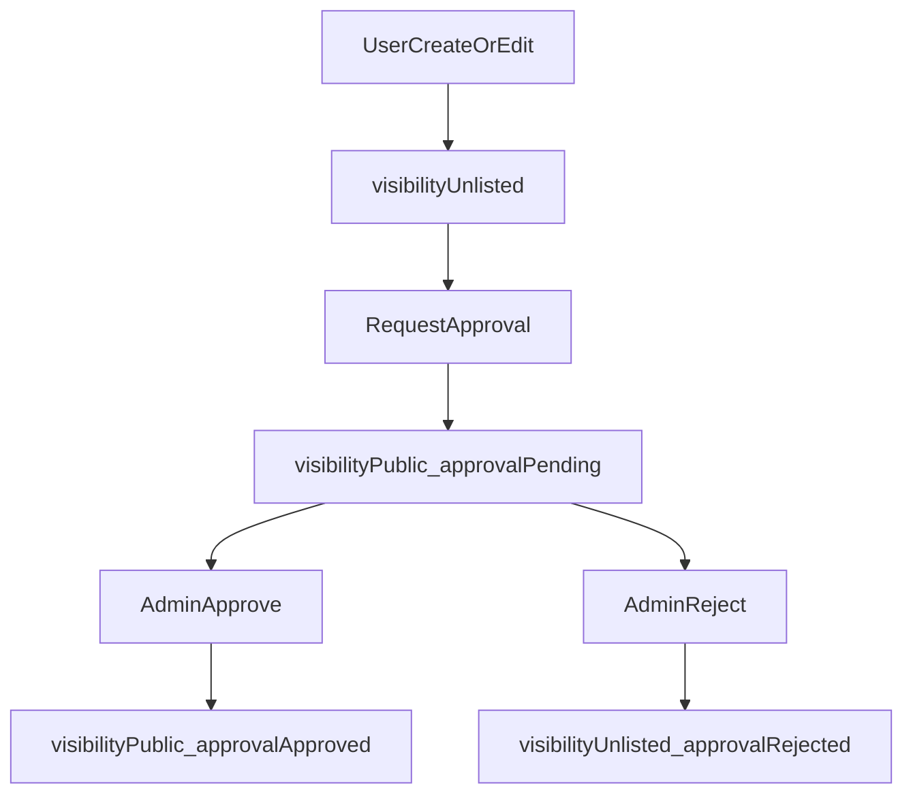

# Aprovação de Cards (Aprovados/Validando)

## Objetivo

- Trocar a aba Global **“Públicos”** por **“Aprovados”**.
- Criar a aba Global **“Validando”** para cards enviados por usuários para aprovação.
- Permitir que **qualquer usuário autenticado** crie/edite seus próprios cards; **apenas admin** aprova.

## Supabase (ambiente alvo)

- **project_id**: `xgpzbolfhgjhrydtcvug` (Projeto 10xdev)

## Descobertas do estado atual (importante)

- O backend hoje tem `visibility` (`public/private/unlisted`) em `[backend/src/types/cardfeature.ts](backend/src/types/cardfeature.ts)` e usa isso para controle de listagens em `[backend/src/models/CardFeatureModel.ts](backend/src/models/CardFeatureModel.ts)`.
- Porém as rotas de escrita de cards estão restritas a admin em `[backend/src/routes/cardFeatureRoutes.ts](backend/src/routes/cardFeatureRoutes.ts)` (isso hoje impede o fluxo “usuário cria e pede aprovação”).

## Design pro MVP (simples e evolutivo)

### 1) Novo conceito: status de aprovação separado de `visibility`

Adicionar em `card_features` um campo `approval_status` (enum/text) com valores:

- `approved` (aparece no diretório global “Aprovados”)
- `pending` (aparece em “Validando”)
- `rejected` (volta para o dono; não aparece no diretório global)
- (opcional) `none`/`null` para cards que nunca pediram diretório global

Regras:

- **Aprovados (Global)** = `visibility='public' AND approval_status='approved'`
- **Validando (Global)** = `visibility='public' AND approval_status='pending'`
- **Seu Espaço** continua usando `visibility='unlisted'` e `visibility='private'`.

### 2) Publicar para o global vira “solicitação”

Quando um usuário tentar “tornar público”:

- Backend converte para: `visibility='public'` + `approval_status='pending'`.
- O card **não aparece** em “Aprovados” até admin aprovar.

### 3) Segurança/visibilidade durante validação

Para evitar “pending” ser público de verdade:

- Em listagens para não-admin, `visibility='public'` deve **por padrão** ser filtrado por `approval_status='approved'` (a menos que admin esteja consultando).
- Acesso por ID (`GET /card-features/:id`) deve bloquear `pending`/`rejected` para terceiros (permitir apenas **admin** e **criador**).

## Mudanças no backend

### A) Migração de banco

- **Não criar arquivo `.sql` no repo.** Aplicar a migração diretamente no Supabase via MCP, usando `mcp_supabase_apply_migration` no projeto `xgpzbolfhgjhrydtcvug`, para:
  - adicionar coluna `approval_status`
  - (opcional) colunas de auditoria: `approval_requested_at`, `approved_at`, `approved_by`
  - backfill: para registros existentes `visibility='public'` -> `approval_status='approved'`
  - criar índice `(visibility, approval_status)` para acelerar “Aprovados/Validando”

### B) Tipos e query params

- Atualizar `[backend/src/types/cardfeature.ts](backend/src/types/cardfeature.ts)`:
  - incluir `approval_status` no `CardFeatureRow/Response`
  - incluir `approval_status` em `CardFeatureQueryParams`

### C) Filtragem e controle de acesso

- Atualizar `[backend/src/models/CardFeatureModel.ts](backend/src/models/CardFeatureModel.ts)`:
  - `buildQuery`: quando `visibility=public` e o usuário **não é admin**, filtrar por `approval_status='approved'` (salvo quando explicitamente buscando a fila “Validando” como admin).
  - `findById`: bloquear `pending/rejected` para não-admin/não-dono.

### D) Escrita: liberar criação/edição para usuários autenticados, manter aprovação exclusiva do admin

- Ajustar `[backend/src/routes/cardFeatureRoutes.ts](backend/src/routes/cardFeatureRoutes.ts)`:
  - `POST /` e `PUT /:id` e `DELETE /:id`: trocar `requireAdmin` por `authenticate`.
  - manter bulk operations como admin-only.
- Em `[backend/src/models/CardFeatureModel.ts](backend/src/models/CardFeatureModel.ts)`/`update`:
  - Se **não-admin** tentar setar `approval_status='approved'`, negar.
  - Se **não-admin** setar `visibility='public'`, forçar `approval_status='pending'`.
- Criar rotas admin para moderação (mais claro que usar update genérico):
  - `POST /api/card-features/:id/approve`
  - `POST /api/card-features/:id/reject`

Implementação em `[backend/src/controllers/CardFeatureController.ts](backend/src/controllers/CardFeatureController.ts)`.

## Mudanças no frontend

### A) UI das tabs em Codes

- Atualizar `[frontend/pages/Codes.tsx](frontend/pages/Codes.tsx)`:
  - Renomear “Públicos” -> “Aprovados”.
  - Adicionar tab “Validando” no grupo Global.
  - Fazer o filtro “Aprovados/Validando” usar `approval_status` via query params (não apenas `visibility`).

### B) Modelo e serviços

- Atualizar tipos em `[frontend/types/cardfeature.ts](frontend/types/cardfeature.ts)` para incluir `approval_status`.
- Atualizar `[frontend/types/api.ts](frontend/types/api.ts)`/`QueryParams` para aceitar `approval_status`.
- Propagar em `[frontend/hooks/useCardFeatures.ts](frontend/hooks/useCardFeatures.ts)` e `[frontend/services/cardFeatureService.ts](frontend/services/cardFeatureService.ts)`.

### C) Criação/edição

- Atualizar `[frontend/components/CardFeatureForm.tsx](frontend/components/CardFeatureForm.tsx)`:
  - Para usuário normal, default de criação: `visibility=unlisted`.
  - Se escolher “Publicar no diretório global”, mostrar texto “Vai para validação (Validando) antes de aparecer em Aprovados”.
  - (opcional) esconder a opção “Público” e trocar por “Enviar para aprovação”.

### D) Moderação no frontend (admin)

- Em “Validando”, mostrar botões **Aprovar** e **Rejeitar** para admin (usando as novas rotas).

## Fluxo (visão rápida)

## Critérios de sucesso (checáveis)

- Usuário autenticado consegue criar card e ele nasce como **Não Listado**.
- Ao solicitar ir para o global, o card aparece em **Validando** e não em **Aprovados**.
- Não-admin não consegue aprovar (API nega).
- Admin aprova e o card migra para **Aprovados**.
- Cards `pending`/`rejected` não vazam em listagens públicas nem por acesso direto de terceiros.

## Próximas evoluções (depois do MVP)

- Multi-aprovação (2 de 3 revisores) e trilha de auditoria completa.
- Comentários de revisão + checklist de validação.
- Notificações (email/in-app) quando aprovado/rejeitado.

