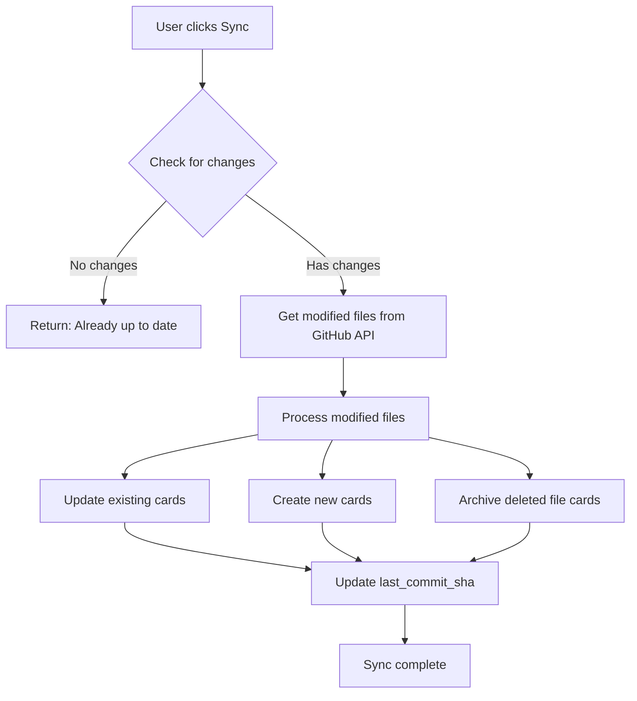

# GitHub Incremental Sync Implementation

## Objetivo

Permitir sincronização incremental de projetos importados do GitHub, processando apenas arquivos modificados desde a última importação, evitando downloads completos do ZIP.

## Arquitetura




## Implementação

### 1. Database Schema Changes

**Tabela `projects`:**

- Adicionar `github_last_commit_sha` (text, nullable) - SHA do último commit processado
- Adicionar `github_synced_at` (timestamp, nullable) - Data da última sincronização
- Adicionar `github_auto_sync_enabled` (boolean, default false) - Habilitar sync automático

**Tabela `card_features`:**

- Adicionar `is_archived` (boolean, default false) - Marcar cards arquivados
- Adicionar `archived_at` (timestamp, nullable) - Data do arquivamento
- Adicionar `source_file_path` (text, nullable) - Caminho do arquivo original no GitHub

### 2. Backend: GitHub Service - Incremental Sync

**Arquivo:** `backend/src/services/githubService.ts`**Novas funções:**

```typescript
// Verificar se há mudanças no repositório
static async checkForUpdates(
  url: string, 
  lastCommitSha: string | null, 
  token?: string
): Promise<{
  hasChanges: boolean
  currentSha?: string
  modifiedFiles?: string[]
  deletedFiles?: string[]
}>

// Obter conteúdo de arquivo específico via GitHub API
static async getFileContent(
  url: string,
  filePath: string,
  token?: string
): Promise<string>

// Processar apenas arquivos modificados
static async syncModifiedFiles(
  url: string,
  modifiedFiles: string[],
  lastCommitSha: string,
  token?: string,
  options?: {
    onProgress?: (update: ProgressUpdate) => void
    onCardReady?: (card: CreateCardFeatureRequest, isModified: boolean) => Promise<void>
  }
): Promise<{ cardsUpdated: number; cardsCreated: number }>
```

**Mudanças em funções existentes:**

- Modificar `processRepoToCards` para aceitar `lastCommitSha` opcional
- Se `lastCommitSha` fornecido, usar sync incremental
- Se não fornecido, usar fluxo completo atual

### 3. Backend: Project Controller - Sync Endpoint

**Arquivo:** `backend/src/controllers/ProjectController.ts`**Novo endpoint:**

```typescript
POST /api/projects/:id/sync-github
Body: { token?: string }
```

**Fluxo:**

1. Buscar projeto e verificar se tem `repository_url`
2. Verificar mudanças usando `GithubService.checkForUpdates`
3. Se sem mudanças, retornar sucesso imediatamente
4. Se com mudanças:

- Criar `import_job` com status 'running'
- Processar arquivos modificados
- Arquivar cards de arquivos deletados
- Atualizar `github_last_commit_sha` e `github_synced_at`
- Finalizar `import_job` com status 'done'

### 4. Backend: Project Model - Update Schema

**Arquivo:** `backend/src/models/ProjectModel.ts`**Mudanças:**

- Atualizar `ProjectRow` type para incluir novos campos
- Atualizar `transformToResponse` para incluir campos de sync
- Adicionar método `updateSyncState(projectId, commitSha, syncedAt)`

### 5. Backend: Card Feature Model - Archive Support

**Arquivo:** `backend/src/models/CardFeatureModel.ts`**Novas funções:**

- `archiveBySourcePath(projectId, filePaths)` - Arquivar cards por caminho de arquivo
- `unarchiveBySourcePath(projectId, filePaths)` - Desarquivar cards
- Atualizar queries para filtrar cards arquivados (opcional, baseado em flag)

### 6. Backend: Migration

**Arquivo:** Nova migration SQL

```sql
-- Adicionar campos de sync na tabela projects
ALTER TABLE projects 
ADD COLUMN IF NOT EXISTS github_last_commit_sha TEXT,
ADD COLUMN IF NOT EXISTS github_synced_at TIMESTAMPTZ,
ADD COLUMN IF NOT EXISTS github_auto_sync_enabled BOOLEAN DEFAULT false;

-- Adicionar campos de arquivo na tabela card_features
ALTER TABLE card_features
ADD COLUMN IF NOT EXISTS is_archived BOOLEAN DEFAULT false,
ADD COLUMN IF NOT EXISTS archived_at TIMESTAMPTZ,
ADD COLUMN IF NOT EXISTS source_file_path TEXT;

-- Criar índice para busca por source_file_path
CREATE INDEX IF NOT EXISTS idx_card_features_source_path 
ON card_features(source_file_path) 
WHERE source_file_path IS NOT NULL;
```


### 7. Frontend: Project Detail - Sync Button

**Arquivo:** `frontend/pages/ProjectDetail.tsx`**Mudanças:**

- Adicionar botão "Sincronizar com GitHub" no header do projeto (se `repositoryUrl` existir)
- Adicionar estado para tracking de sync
- Chamar novo endpoint `/api/projects/:id/sync-github`
- Mostrar progresso usando o mesmo sistema de `importJob` existente
- Exibir mensagem quando não há mudanças

### 8. Frontend: Project Service - Sync Method

**Arquivo:** `frontend/services/projectService.ts` (ou similar)**Novo método:**

```typescript
syncFromGithub(projectId: string, token?: string): Promise<ApiResponse>
```


### 9. Backend: Auto-Sync Background Job (Opcional)

**Arquivo:** `backend/src/jobs/githubAutoSync.ts` (novo)**Implementação:**

- Job que roda periodicamente (ex: a cada hora)
- Busca projetos com `github_auto_sync_enabled = true`
- Executa sync para cada projeto
- Log de resultados

**Integração:**

- Adicionar ao scheduler (cron job ou similar)
- Configurar intervalo via env var `GITHUB_AUTO_SYNC_INTERVAL`

### 10. Frontend: Auto-Sync Toggle (Opcional)

**Arquivo:** `frontend/pages/ProjectDetail.tsx`**Mudanças:**

- Adicionar toggle "Sincronização automática" nas configurações do projeto
- Salvar preferência via update do projeto

## Fluxo de Sincronização

1. **Verificação de mudanças:**

- GET `/repos/:owner/:repo/commits/:branch` - Obter SHA atual
- Comparar com `github_last_commit_sha`
- Se igual, retornar sem mudanças

2. **Obter arquivos modificados:**

- GET `/repos/:owner/:repo/compare/:base...:head`
- Extrair lista de arquivos modificados/deletados

3. **Processar modificados:**

- Para cada arquivo modificado:
    - GET `/repos/:owner/:repo/contents/:path` - Obter conteúdo
    - Processar com IA/heurística (se necessário)
    - Atualizar card existente ou criar novo

4. **Arquivar deletados:**

- Identificar cards com `source_file_path` nos arquivos deletados
- Marcar como `is_archived = true`
- Definir `archived_at = now()`

5. **Atualizar estado:**

- Atualizar `github_last_commit_sha` com SHA atual
- Atualizar `github_synced_at` com timestamp atual

## Considerações

- **Rate Limiting:** GitHub API tem limite de 5000 requests/hora. Implementar cache quando possível.
- **Token:** Usar token do usuário se disponível, senão usar token padrão do sistema.
- **Erros:** Se sync falhar parcialmente, manter estado anterior e reportar erro.
- **Performance:** Processar arquivos em batches para evitar timeout.
- **UI Feedback:** Usar mesmo sistema de progresso da importação inicial.

## Arquivos a Modificar

1. `backend/src/services/githubService.ts` - Adicionar funções de sync incremental
2. `backend/src/controllers/ProjectController.ts` - Novo endpoint de sync
3. `backend/src/models/ProjectModel.ts` - Suporte a campos de sync
4. `backend/src/models/CardFeatureModel.ts` - Suporte a arquivamento
5. `backend/src/types/project.ts` - Atualizar tipos