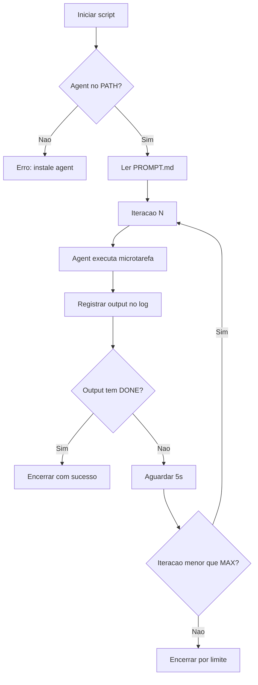

# Manual Ralph + Cursor para 10xdev

## 1. Pre-requisitos

### 1.1 Instalar o Cursor Agent CLI

```bash
curl -fsSL https://cursor.com/install | sh
```

O `agent` e instalado em `~/.local/bin/agent`. O script ralph-cursor.sh adiciona `~/.local/bin` ao PATH antes de rodar.

### 1.2 Autenticar

O erro "Authentication required" aparece sem login. Execute:

```bash
~/.local/bin/agent login
```

(O instalador pede para adicionar `~/.local/bin` ao PATH; se nao fizer, use o caminho completo acima.)

Uma janela do navegador abre; faca login. Apos isso, o Ralph consegue usar o agent.

### 1.3 Permissoes para git e escrita

Sem `~/.cursor/cli-config.json`, o agent nao aplica commits nem atualiza o PRD. Crie:

```bash
mkdir -p ~/.cursor && cat > ~/.cursor/cli-config.json << 'EOF'
{
  "permissions": {
    "allow": [
      "Shell(git)",
      "Shell(npm)",
      "Write(**)"
    ]
  }
}
EOF
```

### 1.4 Ambiente

WSL Ubuntu ou Linux com bash. O script `ralph-cursor.sh` e bash (nao PowerShell).

## 2. Como executar

- **Comando base**: `cd <raiz-do-projeto-10xdev> && bash scripts/ralph-cursor.sh`
- **Com modelo Composer 1.5** (evitar limite Opus): `MODEL="composer-1.5" bash scripts/ralph-cursor.sh`
- **Modo automatico** (sem ENTER): `AUTO_START=1 bash scripts/ralph-cursor.sh`
- **Variaveis**: PROMPT_FILE, COMPLETION_PROMISE, MAX_ITERATIONS, LOG_DIR, AGENT_CMD

## 3. Designar tasks

O Ralph le o backlog de [PRD.json](PRD.json). A ordem de execucao e definida por:

**task_sequence**: array que define a ordem das tasks. A primeira task da sequencia cuja primeira microtarefa esteja `pending` sera executada.

**Estrutura de uma task**:

```json
{
  "id": "minha_task",
  "title": "Descricao da task",
  "status": "pending",
  "scope_files": ["caminho/arquivos"],
  "acceptance": ["criterio 1", "criterio 2"],
  "microtasks": [
    {
      "id": "micro_1",
      "title": "Descricao detalhada da microtarefa",
      "status": "pending",
      "tests": ["npm run lint"],
      "notes": []
    }
  ]
}
```

**Para adicionar uma nova task**:

1. Adicione o `id` em `task_sequence` (na posicao desejada)
2. Adicione o objeto da task em `tasks` com microtarefas granulares (uma por iteracao)

**Para priorizar uma task**: coloque seu `id` no inicio de `task_sequence`.

**Para parar apos uma microtarefa**: inclua na microtarefa a instrucao "Ao concluir output exatamente: DONE". O script detecta DONE e encerra.

## 4. Onde acompanhar

- **Terminal**: o output do agent e exibido em tempo real (tee)
- **Logs**: `logs/ralph-cursor/ralph-cursor-YYYYMMDD-HHMMSS.log`
- **Ultimo log**: `tail -f logs/ralph-cursor/ralph-cursor-*.log` (ou o arquivo mais recente)
- **PRD**: apos cada iteracao, o agent deve atualizar `status` para `done` e adicionar entradas em `updates`

## 5. Fluxo do script



## 6. Troubleshooting

| Problema                                     | Solucao                                                                                |
| -------------------------------------------- | -------------------------------------------------------------------------------------- |
| `agent: command not found`                   | Adicione `~/.local/bin` ao PATH ou use `~/.local/bin/agent`                            |
| `Authentication required`                    | Execute `agent login`                                                                  |
| PRD nao atualiza / commits nao sao aplicados | O script usa `--force`; confira `~/.cursor/cli-config.json` com Write()                |
| Erro `invalid option pipefail`               | Arquivo com CRLF; rode `sed -i 's/\r$//' scripts/ralph-cursor.sh`                      |
| Ralph continua apos task desejada            | Inclua "output exatamente: DONE" na microtarefa ou deixe so essa task em task_sequence |
| Limite Opus                                  | Use `MODEL="composer-1.5"`                                                             |

## 7. Arquivos envolvidos

- [scripts/ralph-cursor.sh](../scripts/ralph-cursor.sh): script principal (bash, WSL)
- [PROMPT.md](PROMPT.md): instrucoes para o agent
- [PRD.json](PRD.json): backlog de tasks e microtasks
- `logs/ralph-cursor/`: pasta de logs (no .gitignore)

## 8. Boas praticas

- Microtarefas pequenas e atômicas (1 por iteracao)
- Instruir o agent a usar aspas simples em `git commit -m` (evitar backticks)
- Para task so de commit: usar a task `ralph_commit_only` como modelo
- Branch `ralph-backup` contem backup das alteracoes do Ralph
